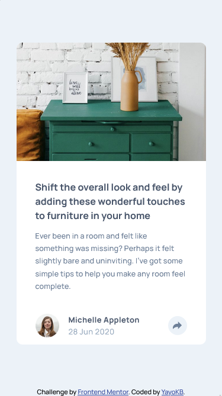

# Frontend Mentor - Article preview component solution

This is a solution to the [Article preview component challenge on Frontend Mentor](https://www.frontendmentor.io/challenges/article-preview-component-dYBN_pYFT). Frontend Mentor challenges help you improve your coding skills by building realistic projects.

## Table of contents

- [Overview](#overview)
  - [The challenge](#the-challenge)
  - [Screenshot](#screenshot)
  - [Links](#links)
- [My process](#my-process)
  - [Built with](#built-with)
  - [What I learned](#what-i-learned)
  - [Continued development](#continued-development)
  - [Useful resources](#useful-resources)
- [Author](#author)
- [Acknowledgments](#acknowledgments)

## Overview

### The challenge

Users should be able to:

- View the optimal layout for the component depending on their device's screen size
- See the social media share links when they click the share icon

### Screenshot

### Links

- Solution URL: [GitHub](https://github.com/YayoKB/fem-article-preview-component)
- Live Site URL: [GitHub Pages](https://yayokb.github.io/fem-article-preview-component)

## My process

### Built with

- Semantic HTML5 markup
- CSS custom properties
- Flexbox
- CSS Grid
- Mobile-first workflow

### What I learned

- I learned how to make a tooltip effect in CSS
- I learned about using `mask` to change the color of an SVG. As I didn't know much about using SVGs and changing their colour, I googled ways in which to do so. I ended up placing a div inside another div, so that I could both change the background colour of the parent div and then the colour of the child div/icon.
- I learned more about using JavaScript and event handlers.

### Continued development

- The Javascript really got to me here combined with the cascading effects of CSS in addition to media queries. I struggled a bit with these and therefore I would like to do some more practice with this, especially media queries in CSS.

### Useful resources

- [How To Make Tooltips With Only CSS](https://www.youtube.com/watch?v=ujlpzTyJp-M) - This was my first time making a tooltip, so I had to look for guidance. This video helped me a lot.

## Author

- GitHub - [YayoKB](https://www.github.com/YayoKB)
- Frontend Mentor - [@YayoKB](https://www.frontendmentor.io/profile/YayoKB)

## Acknowledgments

I would like to thank [Web Dev Simplified](https://www.youtube.com/c/WebDevSimplified) for making such helpful videos.
